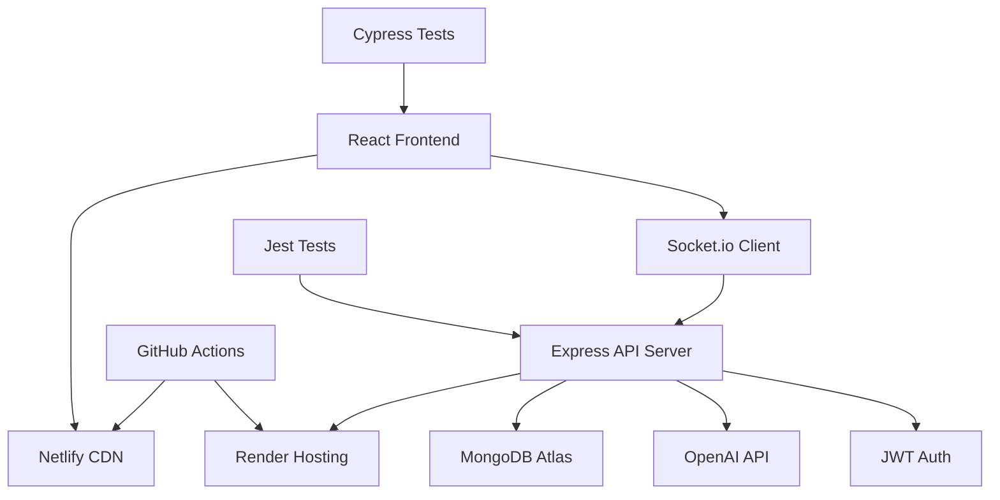
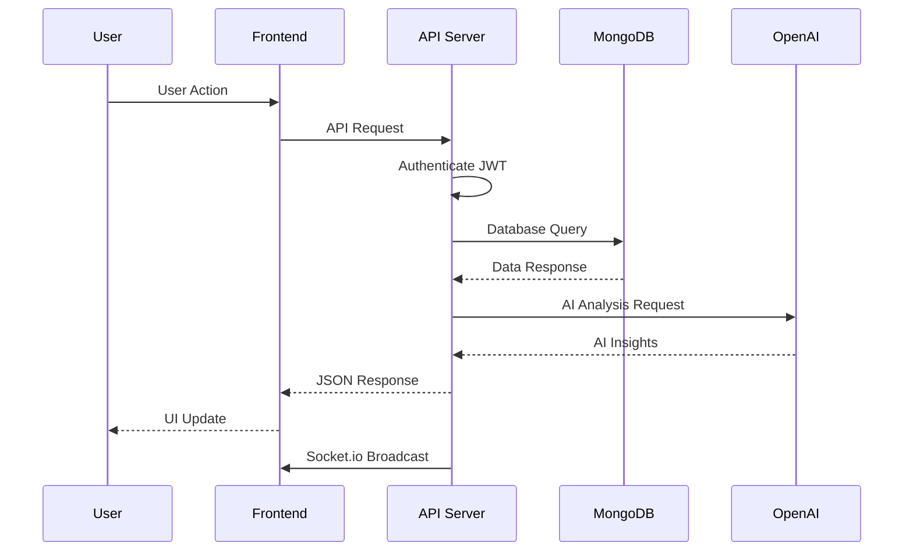
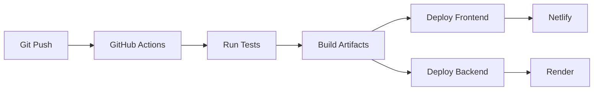

# Technical Architecture Documentation

## Overview

AgriTrace AI is built using the MERN stack (MongoDB, Express.js, React, Node.js) with additional technologies for real-time communication, AI integration, and comprehensive testing.

## Architectural Decisions

### 1. Technology Stack Choice

**Decision:** MERN Stack (MongoDB, Express.js, React, Node.js)

**Rationale:**
- Full JavaScript ecosystem reduces context switching
- Strong community support and extensive documentation
- Scalable for both small and large applications
- Rich ecosystem of libraries and tools

**Pros:**
- Unified language across stack
- Fast development cycles
- Large talent pool
- Cost-effective (open source)

**Cons:**
- Single language can lead to JavaScript fatigue
- Potential performance issues with heavy computations
- Callback hell in asynchronous operations (mitigated by async/await)

**Alternatives Considered:**
- MEAN Stack: Angular instead of React - rejected due to React's component reusability
- Django + React: Python backend - rejected due to team's JavaScript expertise
- Ruby on Rails + React: Rejected due to slower development cycles

### 2. Database Choice

**Decision:** MongoDB with Mongoose ODM

**Rationale:**
- Flexible schema for agricultural data with varying attributes
- JSON-like documents match JavaScript objects
- Horizontal scaling capabilities
- Rich querying and aggregation features

**Pros:**
- Schema flexibility for dynamic farm data
- Native JSON support
- Built-in aggregation pipelines for analytics
- Easy integration with Node.js

**Cons:**
- No ACID transactions (compensated with careful design)
- Potential data consistency issues
- Learning curve for complex queries

**Alternatives Considered:**
- PostgreSQL: Relational database - rejected due to rigid schema requirements
- MySQL: Similar to PostgreSQL, less flexible for dynamic data
- Firebase: Managed NoSQL - rejected due to vendor lock-in concerns

### 3. Authentication System

**Decision:** JWT-based authentication with role-based access control

**Rationale:**
- Stateless authentication suitable for REST APIs
- Role-based permissions for Admin, Field Officer, Farmer
- Secure token-based authorization

**Pros:**
- Stateless and scalable
- Cross-platform compatibility
- Fine-grained access control
- Secure token expiration

**Cons:**
- Token revocation complexity
- Storage of sensitive data in tokens
- Potential for token theft

**Alternatives Considered:**
- Session-based auth: Rejected due to scalability concerns
- OAuth 2.0: Overkill for internal application
- Basic Auth: Insufficient security

### 4. Real-time Communication

**Decision:** Socket.io for WebSocket communication

**Rationale:**
- Bidirectional real-time communication
- Fallback to HTTP polling for compatibility
- Room-based messaging for targeted updates

**Pros:**
- Real-time user experience
- Automatic reconnection handling
- Cross-browser compatibility
- Event-driven architecture

**Cons:**
- Increased server complexity
- Potential performance overhead
- Debugging complexity

**Alternatives Considered:**
- WebSockets native: Too low-level, no fallback
- Server-Sent Events: One-way communication only
- Polling: High latency and server load

### 5. AI Integration

**Decision:** OpenAI GPT-4 via API

**Rationale:**
- Powerful language model for natural insights
- Easy integration via REST API
- Cost-effective for occasional AI requests

**Pros:**
- High-quality natural language responses
- Flexible prompt engineering
- Rapid development of AI features
- No ML infrastructure management

**Cons:**
- API costs scale with usage
- Dependency on external service
- Potential API rate limits
- Data privacy concerns

**Alternatives Considered:**
- Custom ML models: Too time-intensive for capstone
- Google AI/Gemini: Similar API-based approach
- Local LLM: Resource-intensive for deployment

### 6. Frontend Framework

**Decision:** React 19 with Vite

**Rationale:**
- Component-based architecture for reusable UI
- Virtual DOM for efficient rendering
- Rich ecosystem of libraries
- Modern development experience with Vite

**Pros:**
- Declarative UI development
- Component reusability
- Strong developer tools
- Large community support

**Cons:**
- Learning curve for JSX
- Frequent framework updates
- Bundle size concerns (mitigated by code splitting)

**Alternatives Considered:**
- Vue.js: Similar but smaller ecosystem
- Svelte: Compile-time optimization but less mature
- Vanilla JS: Too low-level for complex UI

### 7. Testing Strategy

**Decision:** Jest for unit/integration, Cypress for E2E

**Rationale:**
- Comprehensive test coverage across all layers
- Fast unit tests with mocking
- Real browser E2E testing

**Pros:**
- High test reliability
- CI/CD integration
- Developer-friendly debugging
- Parallel test execution

**Cons:**
- Test maintenance overhead
- Flaky E2E tests
- Learning curve for test writing

**Alternatives Considered:**
- Mocha/Chai: More flexible but less integrated
- Selenium: Browser automation but slower
- No E2E testing: Insufficient coverage

### 8. Deployment Strategy

**Decision:** Netlify (frontend) + Render (backend)

**Rationale:**
- Managed platforms reduce DevOps overhead
- Automatic scaling and SSL
- Git-based deployments

**Pros:**
- Zero server management
- Automatic HTTPS
- Global CDN for frontend
- Easy rollback capabilities

**Cons:**
- Vendor lock-in
- Limited customization
- Potential cold start issues

**Alternatives Considered:**
- AWS/Heroku: More complex setup
- Self-hosted: High maintenance
- Vercel + Railway: Similar managed approach

## System Architecture Diagrams

### Overall System Architecture

### Data Flow Architecture

## Security Architecture

### Authentication Flow
1. User login with credentials
2. Server validates and issues JWT
3. Client stores token in localStorage
4. Subsequent requests include Bearer token
5. Server validates token on each request

### Security Measures
- bcrypt password hashing
- JWT token expiration (24h)
- CORS configuration
- Helmet security headers
- Input validation and sanitization
- Rate limiting (implemented via hosting platforms)

## Performance Considerations

### Frontend Optimization
- Code splitting with React.lazy
- Image optimization and lazy loading
- Bundle analysis and tree shaking
- CDN delivery via Netlify

### Backend Optimization
- Database indexing on frequently queried fields
- Connection pooling with MongoDB
- Caching strategies for AI responses
- Compression middleware

### Database Optimization
- Compound indexes for complex queries
- Aggregation pipelines for analytics
- Data pagination for large result sets
- Read/write separation (future enhancement)

## Scalability Considerations

### Horizontal Scaling
- Stateless API design enables multiple instances
- MongoDB Atlas provides auto-scaling
- Load balancer distribution (via hosting platforms)

### Vertical Scaling
- Memory optimization in Node.js
- Database query optimization
- CDN for static asset delivery

### Future Scaling Strategies
- Microservices architecture for AI processing
- Redis caching layer
- Message queues for background processing

## Monitoring and Observability

### Error Tracking
- Sentry integration for error reporting
- Custom error boundaries in React
- Structured logging in backend

### Performance Monitoring
- API response time tracking
- Database query performance
- Frontend bundle size monitoring

### Business Metrics
- User engagement analytics
- Feature usage tracking
- AI API usage monitoring

## Deployment Architecture

### CI/CD Pipeline

### Environment Management
- Development: Local development with hot reload
- Staging: Automated deployment on feature branches
- Production: Main branch deployment with monitoring

## Conclusion

The architectural decisions for AgriTrace AI prioritize development speed, scalability, and maintainability while ensuring security and performance. The MERN stack provides a solid foundation for rapid prototyping and production deployment, with room for future enhancements as the application grows.

Key architectural strengths:
- Modular, component-based design
- Comprehensive testing strategy
- Real-time capabilities for modern UX
- AI integration for intelligent insights
- Production-ready deployment pipeline

Future architectural considerations may include microservices decomposition, advanced caching strategies, and enhanced monitoring as user adoption grows.