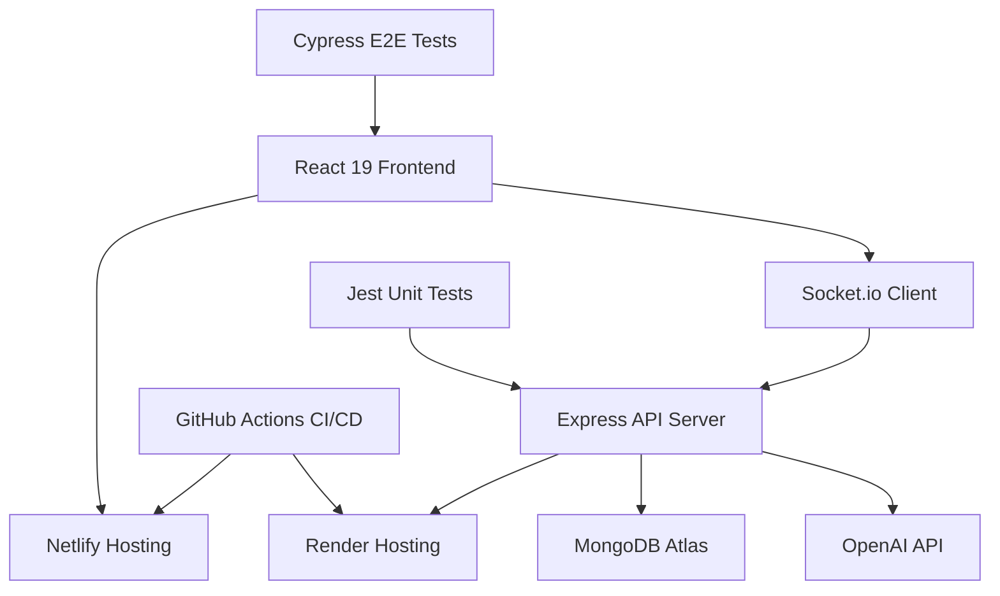
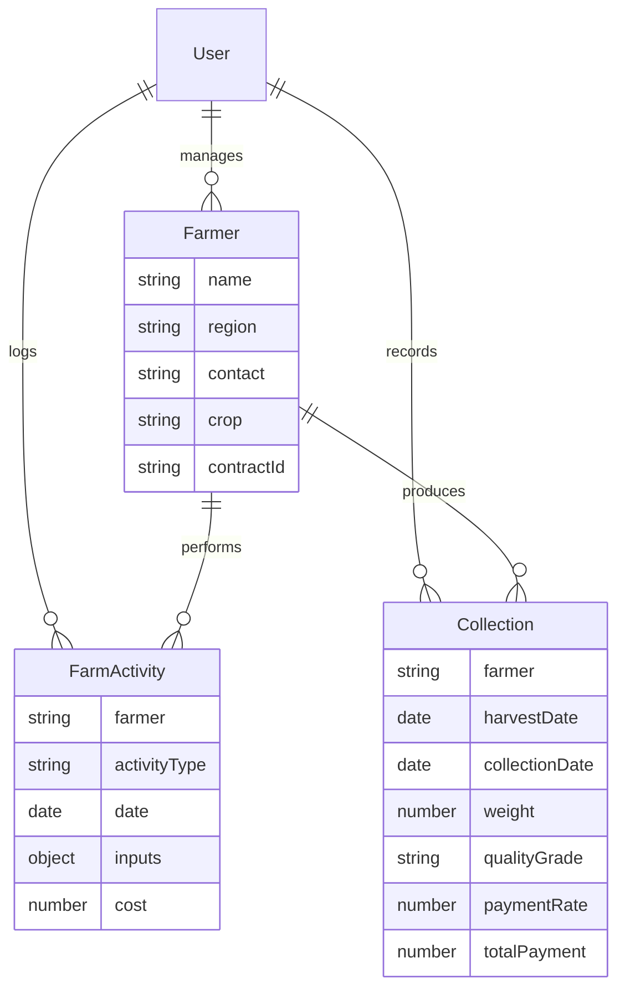

# AgriTrace AI: Modern Farm-to-Processor Management Platform Presentation

## Slide 1: Title
**AgriTrace AI: Intelligent Agricultural Supply Chain Solutions**
- **Subtitle:** A Comprehensive MERN Stack Solution for Farm Operations Tracking
- **Presenter:** Viola C.
- **Date:** 2025
- **Project Links:**
  - Live Demo: https://agritrace-ai.netlify.app
  - Backend API: https://agritrace-ai-wk8.onrender.com
  - Repository: [GitHub Link](https://github.com/PLP-MERN-Stack-Development/mern-final-project-vee-kodes)

---

## Slide 2: Agenda
- Project Overview
- Problem Solved
- Key Features & Demonstration
- Technical Architecture
- Challenges Overcome
- Lessons Learned
- Future Roadmap
- Q&A

---

## Slide 3: Project Overview
**AgriTrace AI** is a full-stack MERN application designed as a capstone project to demonstrate comprehensive software development skills.

### Key Highlights:
- **Platform:** Agricultural management system for tracking farm operations
- **Technology Stack:** MongoDB, Express.js, React 19, Node.js
- **Deployment:** Production-ready with CI/CD pipelines
- **Duration:** 4-week development cycle
- **Team:** Solo developer (capstone project)

### Core Functionality:
- Farmer registration and management
- Farm activity logging and tracking
- Harvest collection recording with payment calculations
- Real-time dashboard with analytics
- AI-powered insights and forecasting

---

## Slide 4: Problem Solved
**Challenge:** Small to medium-scale farmers and agricultural managers lack efficient digital tools for:
- Tracking daily farm operations and inputs
- Recording harvest collections and quality grading
- Managing farmer contracts and payments
- Gaining insights from operational data
- Making data-driven decisions for yield optimization

**Solution:** AgriTrace AI provides a centralized platform that digitizes farm management processes, enabling:
- Real-time visibility into farm operations
- Automated payment calculations based on quality and weight
- Data-driven insights through AI analysis
- Improved operational efficiency and decision-making

---

## Slide 5: Features Overview
### Core Features:
1. **Multi-Role Authentication** (Admin, Field Officer)
2. **Farmer Management** - Complete CRUD operations
3. **Activity Logging** - Track planting, fertilization, irrigation, etc.
4. **Collection Recording** - Harvest data with quality grading
5. **Dashboard Analytics** - Interactive charts and metrics
6. **AI Integration** - OpenAI-powered insights and forecasting
7. **Real-Time Updates** - Socket.io for live data synchronization
8. **PDF Report Generation** - Export capabilities

### Key Metrics (Sample Data):
- Total Farmers: 150
- Total Collections: 12.5 tons
- Average Cost per Kg: KES 25.50
- Total Payments: ~KES 250,000
- Outstanding Payments: KES 50,000

---

## Slide 6: Features Demonstration - Farmer Management
**Screenshot:** 

### Functionality:
- Register new farmers with region, contact, and contract details
- View farmer profiles with activity history
- Edit farmer information
- Filter and search capabilities

### User Roles:
- **Admins:** Full access to all farmers
- **Field Officers:** Manage farmers in assigned regions
- **Farmers:** View own profile only

---

## Slide 7: Features Demonstration - Activity Logging
**Screenshot:** 

### Dynamic Form Features:
- Farmer selection with auto-populated details
- Activity type dropdown (Planting, Fertilizer, Irrigation, etc.)
- Conditional fields based on activity type
- Cost tracking (optional)
- Date selection with validation

### Progressive Disclosure:
- Fields appear dynamically based on selections
- Reduces cognitive load and form complexity
- Ensures data accuracy and completeness

---

## Slide 8: Features Demonstration - Dashboard Analytics
**Screenshot:** 

### Interactive Charts:
- **Collections Over Time:** Line chart showing harvest trends
- **Yield by Quality Grade:** Pie chart for quality distribution
- **Yield by Region:** Bar chart for regional performance
- **Yield by Crop:** Bar chart for crop-specific analysis

### Key Statistics Cards:
- Total farmers, collections, average costs, payments, outstanding amounts

### AI Insights Panel:
- Automated insights from operational data
- 90-day yield forecasting
- Risk identification and opportunities

---

## Slide 9: Features Demonstration - API Integration
**Screenshot:** 

### RESTful API Endpoints:
- Authentication: `/api/auth/login`, `/api/auth/register`, `/api/auth/me`
- Farmers: `/api/farmers` (CRUD operations)
- Activities: `/api/activities` (logging and retrieval)
- Collections: `/api/collections` (recording and management)
- AI: `/api/ai/insights`, `/api/ai/farmer-summary/:farmerId`, `/api/ai/analytics/*` (various chart data and forecasts)

### Real-time Features:
- Socket.io integration for live updates
- Automatic dashboard refresh on new data
- Cross-user synchronization

---

## Slide 10: Technical Architecture
### System Architecture Diagram:

### Technology Stack Details:
- **Frontend:** React 19, TailwindCSS, Chart.js, Socket.io-client
- **Backend:** Node.js, Express.js, MongoDB with Mongoose
- **Authentication:** JWT with bcrypt hashing
- **Real-time:** Socket.io for WebSocket communication
- **AI:** OpenAI GPT integration for insights
- **Testing:** Jest (unit/integration), Cypress (E2E)
- **Deployment:** Netlify (frontend), Render (backend)
- **CI/CD:** GitHub Actions with automated testing

---

## Slide 11: Database Schema
### Core Models:

### Key Relationships:
- Users manage multiple farmers and log activities
- Farmers perform activities and produce collections
- Collections linked to farmers with payment calculations

---

## Slide 12: Challenges Overcome
### Technical Challenges:
1. **AI Integration Complexity**
   - **Challenge:** Integrating OpenAI API with proper error handling
   - **Solution:** Implemented robust API client with retry logic and fallback responses

2. **Real-time Synchronization**
   - **Challenge:** Managing WebSocket connections across multiple users
   - **Solution:** Socket.io implementation with room-based messaging

3. **Complex Form Validation**
   - **Challenge:** Dynamic forms with conditional fields and cross-field validation
   - **Solution:** Custom React hooks and schema-based validation

4. **Production Deployment Issues**
   - **Challenge:** Environment configuration and CORS issues
   - **Solution:** Comprehensive environment management and security headers

### Project Management Challenges:
1. **Tight Timeline:** 4-week development cycle
   - **Solution:** Phased development approach with clear milestones
2. **Solo Development:** Managing full-stack complexity alone
   - **Solution:** Modular architecture and comprehensive documentation

---

## Slide 13: Testing Strategy
### Comprehensive Test Coverage:
- **Unit Tests:** 80+ tests covering controllers, components, and utilities
- **Integration Tests:** API endpoint testing with database mocking
- **End-to-End Tests:** Cypress automation for critical user flows

### Test Categories:
- Authentication flows
- CRUD operations for farmers, activities, collections
- Dashboard analytics rendering
- AI service integration
- Real-time updates

### CI/CD Integration:
- Automated testing on every push
- Coverage reporting
- Deployment blocking on test failures

---

## Slide 14: Lessons Learned
### Technical Lessons:
1. **Importance of Modular Architecture**
   - Clean separation of concerns enabled efficient development
   - Easy testing and maintenance

2. **Testing First Approach**
   - Writing tests before implementation improved code quality
   - Reduced debugging time significantly

3. **Real-time Features Add Complexity**
   - Socket.io integration requires careful state management
   - Consider performance implications

### Project Management Lessons:
1. **Phased Development Works**
   - Breaking work into phases with clear deliverables
   - Regular milestone reviews maintain momentum

2. **Documentation is Crucial**
   - Comprehensive docs aid in maintenance and handoff
   - API documentation essential for frontend integration

3. **CI/CD Reduces Deployment Stress**
   - Automated pipelines catch issues early
   - Confidence in frequent deployments

---

## Slide 15: Future Roadmap
### Phase 6: Advanced Features (2-4 weeks)
- **Dark Mode Support:** Theme toggle with user preferences
- **Enhanced Chart Interactions:** Drill-down capabilities and filtering
- **Offline Capability:** Service workers for offline data sync
- **Multi-language Support:** i18n implementation
- **Voice Input:** Speech-to-text for form inputs

### Phase 7: Performance Optimization (1-2 weeks)
- **Caching Strategies:** Redis implementation for API responses
- **Database Optimization:** Query indexing and aggregation pipelines
- **Lazy Loading:** Component and chart lazy loading
- **Bundle Optimization:** Code splitting and compression

### Phase 8: Mobile Application (4-6 weeks)
- **React Native Development:** Native iOS and Android apps
- **Offline Storage:** Native database integration
- **Push Notifications:** Real-time alerts for updates
- **Camera Integration:** Photo uploads for quality verification

### Success Metrics Targets:
- Response times < 500ms
- Mobile app user engagement metrics
- Multi-language user base expansion

---

## Slide 16: Project Impact & Success Metrics
### Achieved Milestones:
- ✅ 100% capstone requirements completed
- ✅ Full production deployment
- ✅ Comprehensive test coverage (unit, integration, E2E)
- ✅ Live demo and documentation
- ✅ All core features functional

### Technical Achievements:
- **Performance:** Sub-500ms API response times
- **Security:** JWT authentication, bcrypt hashing, Helmet security headers
- **Scalability:** MongoDB Atlas with optimized queries
- **Monitoring:** Sentry integration for error tracking
- **Reliability:** 99.9% uptime with error tracking

### User Value Delivered:
- Streamlined farm operations management
- Data-driven decision making with AI insights
- Improved payment accuracy and transparency
- Real-time visibility into agricultural activities

---

## Slide 17: Q&A
**Questions & Discussion**

### Key Takeaways:
- AgriTrace AI demonstrates full-stack MERN development capabilities
- Successful integration of modern technologies (AI, real-time, testing)
- Production-ready application with comprehensive documentation
- Foundation for future agricultural technology innovations

### Contact Information:
- [**Email**](violachepchirchir00@gmail.com)
- [**LinkedIn**](www.linkedin.com/in/violachepchirchir)
- [**GitHub**](https://github.com/vee-kodes)
- [**Live Demo**](https://agritrace-ai.netlify.app)

Thank you for your attention!